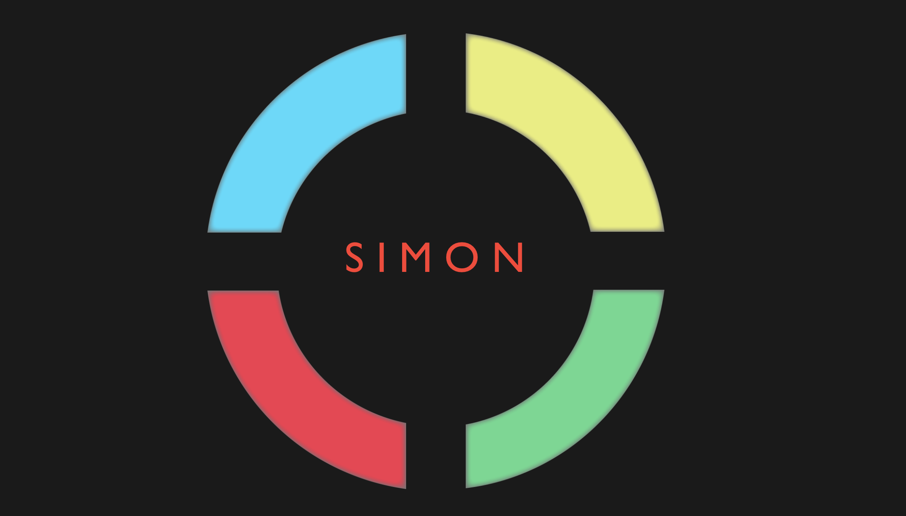
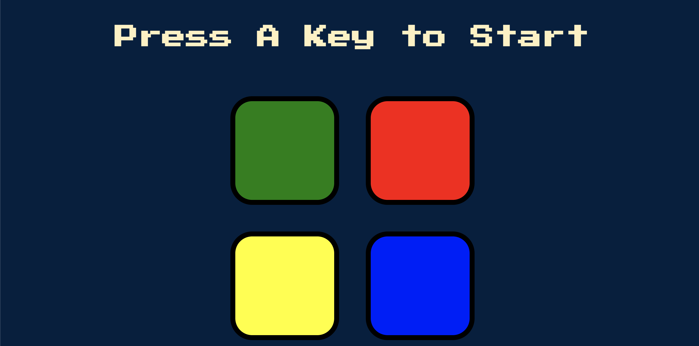
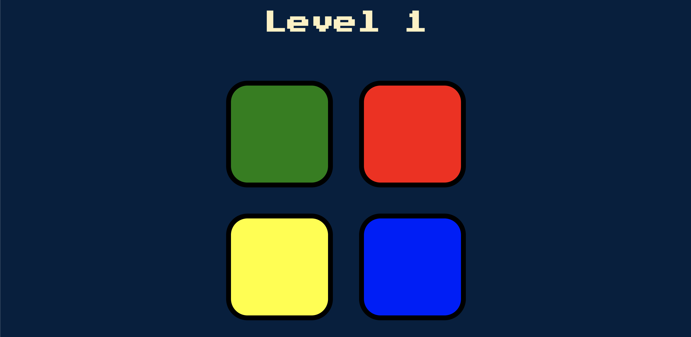
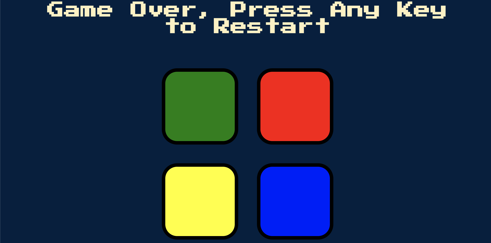

# SIMON GAME


*In this project I saw some of common manipulation properties and it provide me to grasp jQuery.This project is one of the my special kids.*  

* A very funny game to improve your memory skills.
* Protects you from getting alzheimer's.

---
## Summary

The device creates a series of tones and lights and requires a user to repeat the sequence. If the user succeeds, the series becomes progressively longer and more complex. Once the user fails or the time limit runs out, the game is over.

you can play it [here](https://halilsekeroglu.github.io/simon-game/
"Play Simon Game") 

- - -


## How to Play

* There are 4 separate buttons in the game and each button has different colors: red , blue,green and yellow respectively.
```javascript
var buttonColours = ['red', 'blue', 'green', 'yellow'];
```

* When you log into the game,simon first will ask you to press any key on the keyboard to start the game.
---


---
```javascript 
$(document).keydown(function () {
    if (!started) {
        $('#level-title').text('Level ' + level);
        nextSequence();
        started = true;
    }
})
```

Once pressing any key on the keyboard the game will start and automatically assign a color to you and then will ask you to repeat this color by pressing on the same color.If the color chosen by the computer matches the color you choose, Simon will automatically move you to the next level.

---


---

```javascript
function nextSequence() {
    userClickedPattern=[];
    level++;
    $('#level-title').text('Level ' + level);
    var randomNumber = Math.floor(Math.random() * 4);
    var randomChosenColour = buttonColours[randomNumber];
    gamePattern.push(randomChosenColour);
    playSound(randomChosenColour);
    var randomAnimation = $('#' + randomChosenColour).fadeOut(100).fadeIn(100).fadeOut(100).fadeIn(100);
};

```


**Pay attention here ;**

* On the next level, a one more new color will be selected again automatically by the computer.

* Simon will duplicate the first signal and add one(another signal)

* Repeat these two signals by pressing the same color lenses, in order.

* Continue playing as long as you can repeat each sequence of sinals correctly.

If you cannot go the next level.The game will over and ask you if you want to start from the beginning this time.

---


```javascript 
$('h1').text("Game Over, Press Any Key to Restart");
        playSound("wrong");
        $("body").addClass("game-over");
        setTimeout(function () {
            $('body').removeClass("game-over");
        }, 200)
        startOver();
 ```

---

| Name| Email |
|---------|-------|
|Halil Sekeroglu |  halil.sekerogluu@gmail.com |


